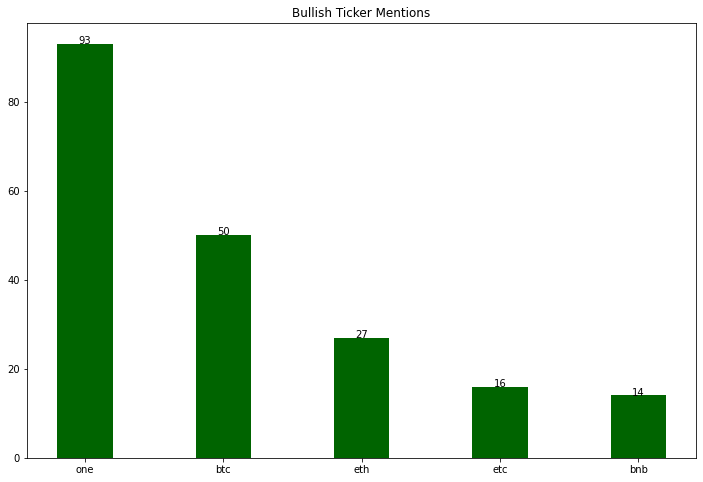

# RedditScraper

- This project uses Vader SentimentIntensityAnalyzer to analyze the current sentiment on cryptocurrency tickers
  and names mentioned under r/cryptocurrency. Compound scores > 0.2 are considered positive sentiment while < 0.2
  are negative, and neutral falls under 0

## Bullish Ticker Mentions

## Bullish Name Mentions

## Bearish Ticker Mentions

## Bearish Name Mentions

## Neutral Ticker Mentions

## Neutral Name Mentions

