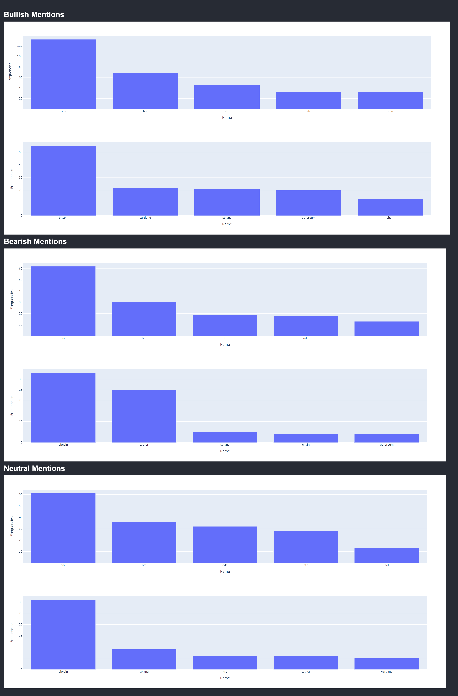

# RedditScraper

- The NLP package used in this sentiment analysis includes Vader SentimentIntensityAnalyzer, stop words, 
  lemmatization, punctuation & digits removal to analyze the current sentiment on cryptocurrency tickers
  and names mentioned under r/cryptocurrency. Compound scores > 0.2 are considered positive sentiment while < 0.2
  are negative, and neutral falls under 0
  

## Flask development application

