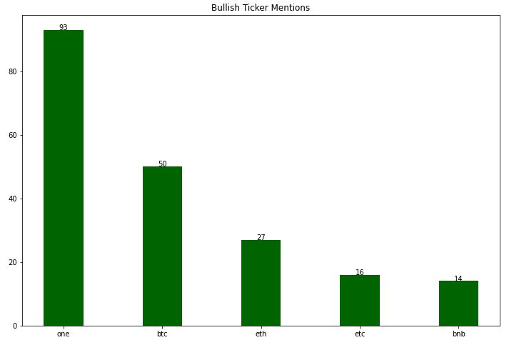
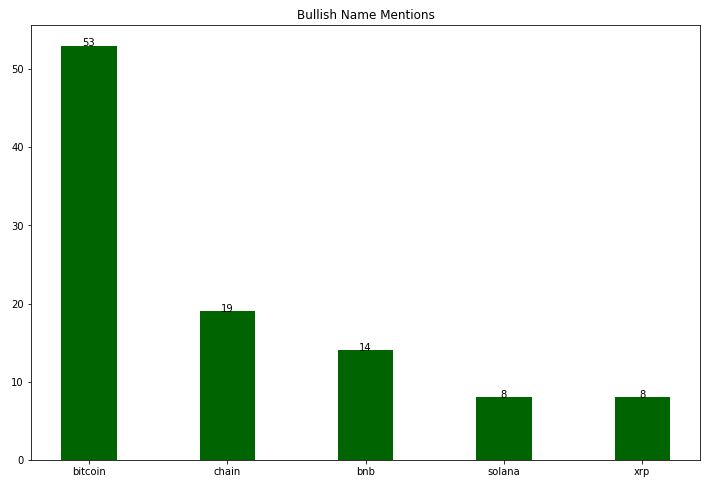
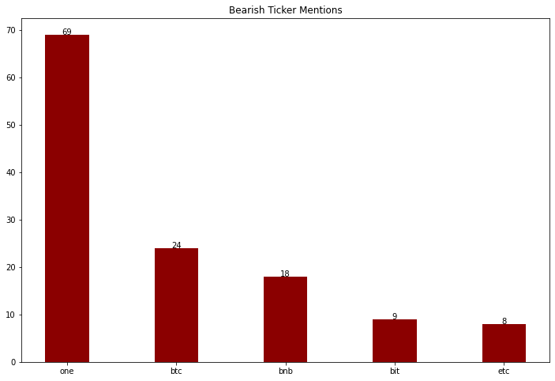
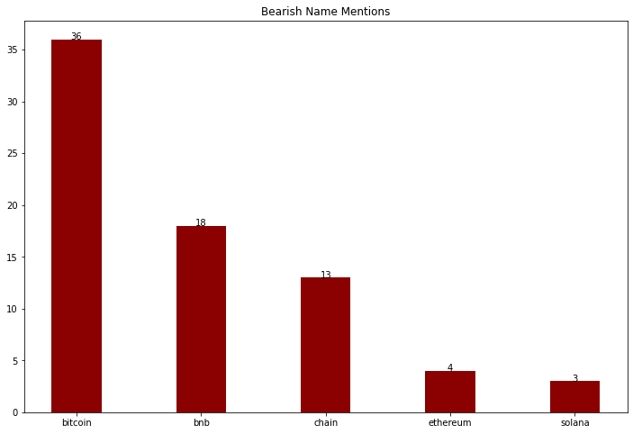
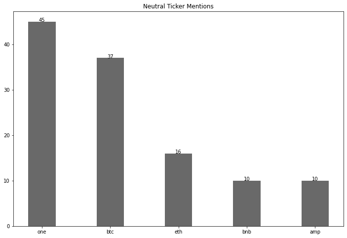
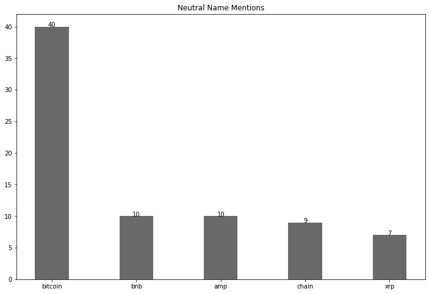

# RedditScraper

- This project uses Vader SentimentIntensityAnalyzer to analyze the current sentiment on cryptocurrency tickers
  and names mentioned under r/cryptocurrency. Compound scores > 0.2 are considered positive sentiment while < 0.2
  are negative, and neutral falls under 0

## Bullish Mentions

 

## Bearish Mentions

 

## Neutral Mentions

 

