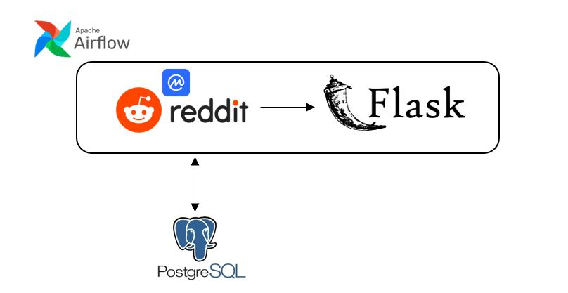
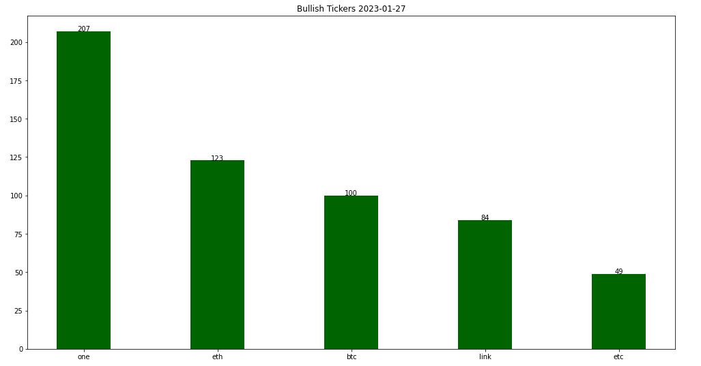
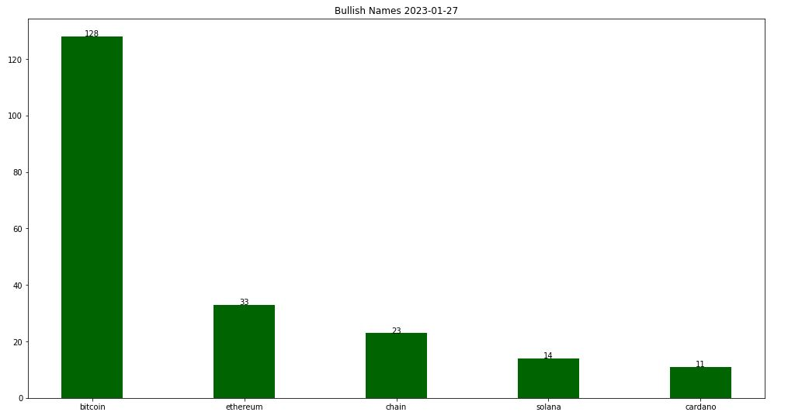
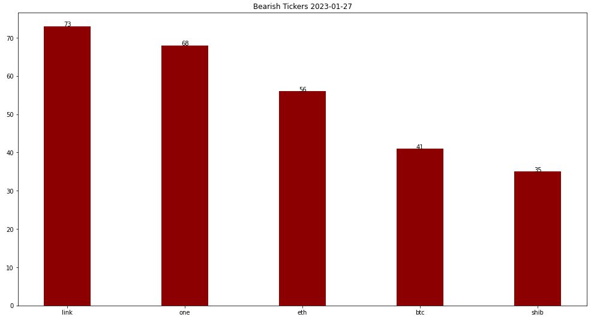
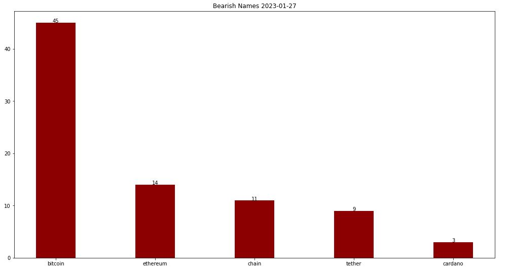
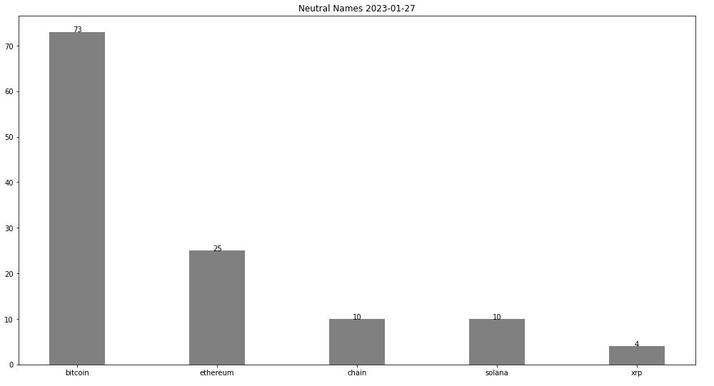

# RedditScraper

- This project uses Reddit's API praw to scrape the contents of r/cryptocurrency. Popular comments in the thread
  are collected for NLP analysis. Airflow will be the workflow scheduler, and Flask development will be used for 
  the front end pipeline

- The NLP package used in this sentiment analysis includes Vader SentimentIntensityAnalyzer, stop words, 
  lemmatization, punctuation & digits removal to analyze the current sentiment on cryptocurrency tickers
  and names mentioned under r/cryptocurrency. Compound scores > 0.2 are considered positive sentiment while < 0.2
  are negative, and neutral falls under 0
  
## Airflow DAG

## Sentiment Analysis

- Sentiment analysis is performed on the number of times each ticker/name was mentioned in the body. A bullish/ bearish
/neutral sentiment can be identified

  

## Flask development application

- This is the front end development containing the per bullish/bearish/neutral sentiment

